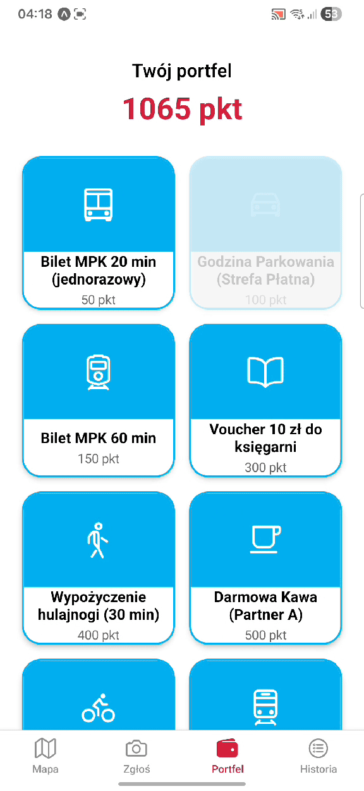

# Łódź Alert - 3rd Place at Łódź Hack

**Authors: Team MPZ (Alicja Świercz & Łukasz Jęcek)**

**Łódź Alert** is an innovative module designed for the "Karta Łodzianina" ecosystem, developed during the Łódź Hack programming marathon. Our goal was to leverage technology to make the city of Łódź more user-friendly and responsive to the needs of its citizens.

### Overview
Currently, reporting urban issues is perceived as difficult and discouraging due to complicated procedures, which leads to a waste of time and money for both residents and the city. Łódź Alert solves this by enabling direct and instantaneous reporting of defects to city officials.

### Key Features
* **2-Click Reporting:** Users take a photo of an issue, and the system handles the rest - no unnecessary forms or stress.
* **AI Categorization:** Artificial Intelligence analyzes the submitted photo, automatically categorizes the problem, and prepares the report for submission.
* **Geospatial Mapping:** Every report is automatically tagged on a map, allowing city services to respond faster and better visualize problem areas.
* **Gamification System:** For every confirmed report, users receive points in their digital wallet, which can be exchanged for rewards from "Karta Łodzianina" partners.

### Project Presentation
A detailed description of the vision, business architecture, and benefits for the city and residents can be found in the full project presentation:
**[View Project Presentation: Łódź Alert - Team MPZ](assets/Lodz-Alert.pdf)**

The presentation includes:
* An analysis of communication problems between residents and the city.
* Examples of rewards in the point system (MPK public transport tickets, vouchers, discounts).
* Benefits for business partners and the city's public image.

### Tech Stack
The application was built as a modern mobile prototype using:
* **Frontend:** React Native (Expo).
* **Maps:** Google Maps integration for spatial data visualization.
* **AI:** LLM integration for image analysis and categorization.
* **Geolocation:** Automatic retrieval of incident coordinates.

---
*Note: This repository contains prototype code created in 24 hours during a hackathon.*
